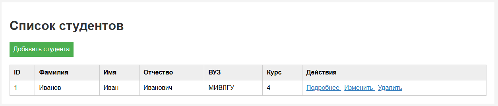
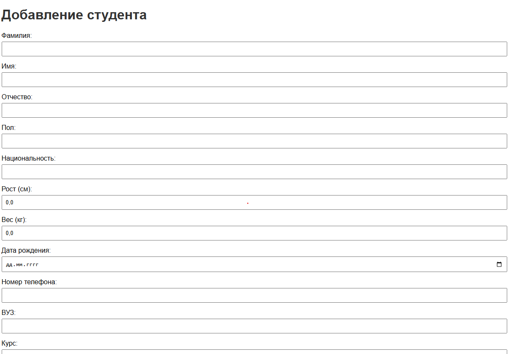

# Лабораторная работа №2. Репозиторий в Spring Data JPA

## Цель работы
Изучить использование репозитория Spring Data JPA для работы с сущностью `Student`. Реализовать основные CRUD-операции: добавление, просмотр, изменение и удаление студентов.

## Архитектура проекта
- **Стек:** Spring Boot 4.1.1, Maven, Spring Data JPA, Thymeleaf, Java 17
- **СУБД:** H2
- **Основные слои:**
  - **Controller:**  - обработка запросов для просмотра, добавления, изменения и удаления студентов(`StudentController`)
  - **Repository:** - репозиторий для работы с сущностью `Student`(`StudentRepository`)
  - **Entity:** `Student` - JPA-сущность, соответствующая таблице `students`.
  - **View:** `students.html`, `student-form.html`, `details.html` - HTML-шаблоны Thymeleaf.
  - **Configuration:** `application.properties` - настройки Spring Boot и подключения к H2.
- **Ключевые аннотации:**
  - `@Entity` - определяет класс `Student` как JPA-сущность.
  - `@Table` - задаёт таблицу `students`.
  - `@Id` - определяет первичный ключ.
  - `@GeneratedValue` - автоматическая генерация ID.
  - `@Controller` - определяет контроллер.
  - `@RequestMapping` - задаёт общий путь `/students`.
  - `@GetMapping` - обработка GET-запросов.
  - `@PostMapping` - обработка POST-запросов.
  - `@PathVariable` - получение ID из URL.
  - `@ModelAttribute` - связывание данных формы с объектом `Student`.

## Алгоритм работы
1. Главная страница (/students) - GET-запрос получает список студентов из базы данных и отображает его в шаблоне students.
2.Добавление студента (/students/new) - GET-запрос отображает форму добавления в шаблоне student-form.
3. Сохранение студента (POST /students/save) - принимает данные студента и сохраняет их через StudentRepository.
4. Просмотр информации (/students/details/{id}) - GET-запрос получает студента по ID и отображает информацию в шаблоне details.
5. Редактирование (/students/update/{id}) - GET-запрос получает данные студента и отображает заполненную форму в шаблоне student-form.
6. Сохранение изменений (POST /students/update) - принимает изменённые данные студента и сохраняет их через StudentRepository.
7. Удаление (/students/delete/{id}) - GET-запрос удаляет студента по ID и возвращает пользователя к списку студентов.

## Скриншоты работы приложения

### Список студентов

### Добавление/редактирование студента

